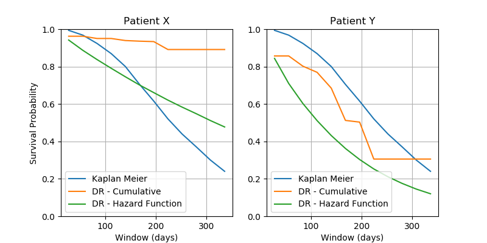

DataRobot Survivial Modelling
=================================

This project demonstrates how you can use Machine Learning with DataRobot
to approach a modelling task that is typically approached with survival analysis.

This code base will build models using two different approaches and allow you to
benchmark them against a non-parametric Kaplan-Meier model.

* Approach 1 - A model that will predict the cumulative probability of the event occuring
over gradually increasing windows that expand the future. This will use the window length
as a feature and impose monotonicty on that feature to ensure you get a valid cumulative 
probability.

* Approach 2 - A model that predict the likelihood of the event occuring within a specific
timestep. This is the ML equivalent of a discrete time hazard function. That can be then used
to create a survivial function in a similar way that a Kaplan-Meier estimate is constructed.


## Data Assumptions

Your data will need be collected in such a way that you have a column that indicates 
the date the event occured (or censoring occured). Along with the a flag column that
indicates if the date is a real event occurence or it is the date at which censoring occured.

There will also be an additional date field, that captures the date of scoring, i.e. the
point in time where you would be generating a prediction or forward looking survival plot.


## Dependencies
 
You will need a DataRobot account and several python libraries, including the DataRobot package

```
pip install pandas
pip install datarobot
```

To run the web application you will need a YAML file that authenticates you against your
DataRobot instance when using the DataRobot Python Package. Please 
[follow these guidelines](https://datarobot-public-api-client.readthedocs-hosted.com/en/v2.7.2/setup/configuration.html) to set up this this configuration file.
 

## About

The core functions that prepare the dataset and build the DataRobot projects can be found
the file [SurvivalAnalysis.py](SurvivalAnalysis.py)
 
These functions are all demonstrated in the example script discussed below.


## Example

In the data directory you will find a small synthetic dataset that contains artifical patient
records for a collection of patients.

These records have been generated to emulate two potential clinical tests, one of which that
is more sensitive that specific, and another that is very specific but not sensitive. There
are also some synthetic demographic charcateristics. The general goal is to simulate a situation
in which men are in general more susceptible than women, and Asian people less susceptible than
other ethnicities. 

In the script [example.py](example.py) you will see how this data is used to build the
two projects in DataRobot. It can be executed as follows:

```
python  example.py
```

It will then produce the plot shown below.




